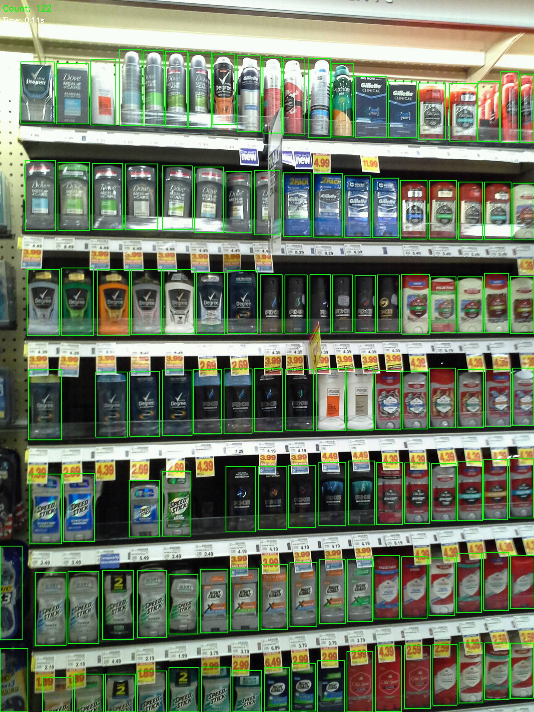
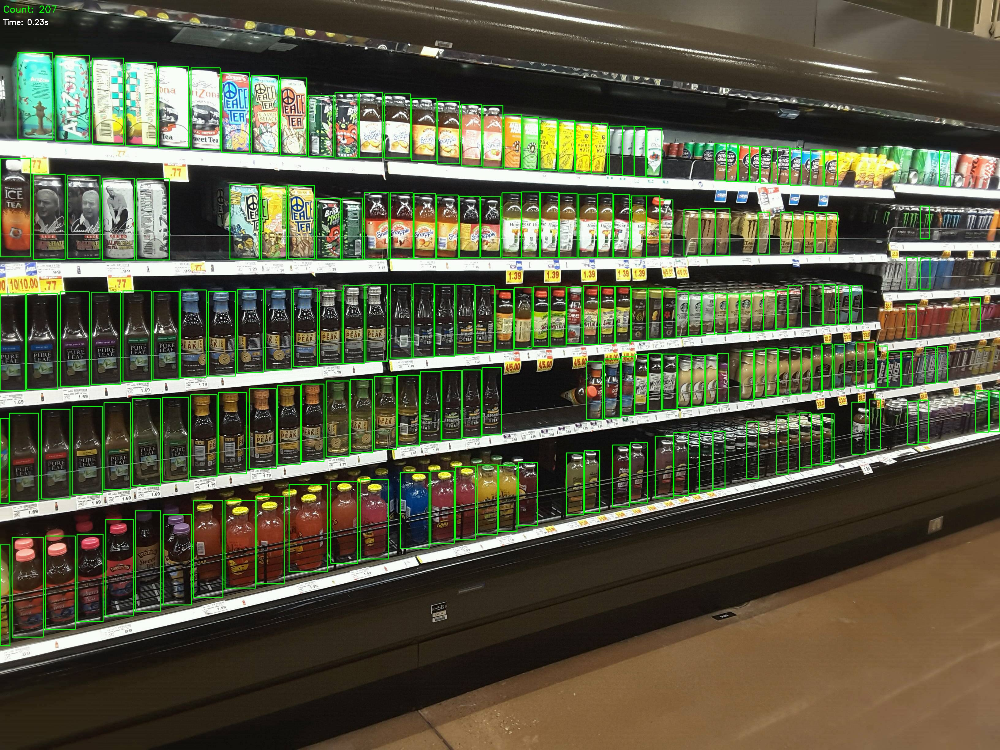
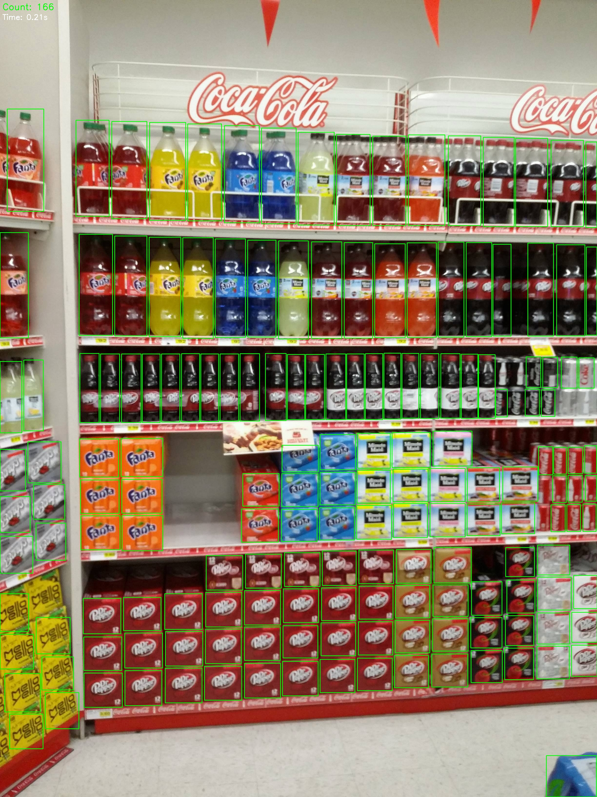

# SKU-110K Shelf Detector (YOLOv8 + FastAPI)

This project is a real-time item detection and counting system built using YOLOv8 and FastAPI. Trained on the SKU110K dataset,it provides a clean web interface to upload shelf images, run inference, visualize detections, and log the results for analysis.
  
---

## Features

- Upload shelf images via web interface
- Detect and count items using a YOLOv8n model  
- Display annotated results with bounding boxes
- Show real-time `inference time` and `object count`
- Save results (filename, count, duration, annotated image) in csv
- Browse inference history on the homepage

---

## Sample Result

### Demo GIF


### Static Detections






## Tech Stack

- [Ultralytics YOLOv8](https://docs.ultralytics.com/)- object detection
- [FastAPI](https://fastapi.tiangolo.com/) - lightweight backend server
- [OpenCV](https://opencv.org/) - image annotation
- HTML + Jinja2 Templates - UI rendering
- Python 3.10+

---

## Project Structure

```
sku110k-yolov8-shelf-detector/
│
├── configs/
│   └── sku110k.yaml              # YOLOv8 dataset config
│
├── data/
│   └── download_sku110k.py       # Optional script to fetch dataset
│
├── datasets/
│   └── SKU-110K/
│       ├── annotations/          # XML annotations (Pascal VOC)
│       ├── images/               # Full dataset images
│       ├── labels/               # YOLO format labels (after conversion)
│       ├── test_images/          # Images used for notebook/demo
│       ├── train.txt             # Training image paths
│       ├── val.txt               # Validation image paths
│       ├── test.txt              # Testing image paths
│       └── LICENCE
│
├── notebooks/
│   └── sku110k_demo.ipynb        # Jupyter notebook demo (YOLOv8)
│
├── outputs/
│   ├── inference_api_results/    # Annotated results + CSV logs
│   ├── shelf-detection.gif       # gif demo
│   ├── sku110k_continue/         # Another added 10 epochs results
│   └── sku110k_run/              # The first 10 epochs
│
├── scripts/
│   ├── main.py                   # FastAPI app entry point
│   ├── train.py                  # Training script
│   ├── infer_and_count.py        # YOLOv8 inference + counter (CLI)
│   ├── run_pipeline.py           # Optional helper
│   └── filter_corrupt_image.py   # Clean noisy images
│
├── src/
│   ├── api.py                    # FastAPI router: upload, inference
│   ├── counting.py               # Counting logic from predictions
│   ├── detect.py                 # YOLOv8 helper text detection
│   ├── train.py                  # main training script 
│
└── templates/              
│   ├── api.py 
├── yolov8n.pt                  
├── README.md
└── requirements.txt

```


## How to Run

1. Clone the repo

git clone https://github.com/Htet-ThuAung/sku110k-yolov8-shelf-detector.git
cd sku110k-yolov8-shelf-detector

2. Install dependencies
`pip install -r requirements.txt`

3. Run the app
`uvicorn scripts.main:app --reload`

4. Open browser:
https://127.0.0.1:8000


## Jupyter Noteook Demo
- Introducing to SKU110K dataset
- Single image + batch detection
- Bounding box visualization
- Training performance:
    - Loss curves
    - PR curve
    - Confusion matrix
- Summary + what's next section


## Training Overview
- Base model: `yolov8n.pt`
- Epochs: 20
- Batch size: 2 (trained on ASUS TUF FX505DD)
- image size: Mixed (1080p - 4K)
- Dataset format: CSV + train.txt, val.txt
- Exported weights: outputs/sku110k_continue/weights/best.pt


## Future Improvements
- Dashboard with charts and real-time stats
- Multi-class detection
- Docker deployment
- Live webcam/CCTV detection with DeepSORT
- Streamlit or Gradio interactive frontend


### Author
Htet Thu Aung
Passionate about computer vision and AI
[LinkedIn](https://www.linkedin.com/in/htetthuaung/)
